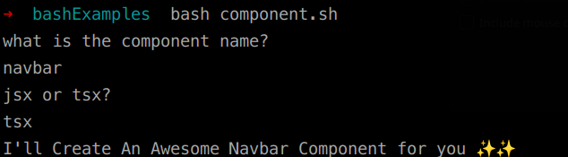
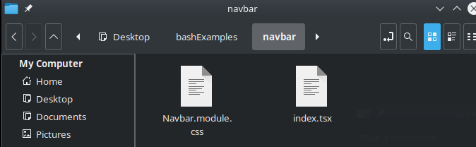
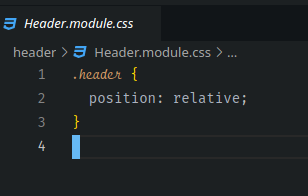
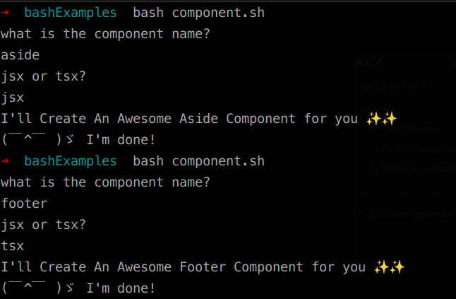
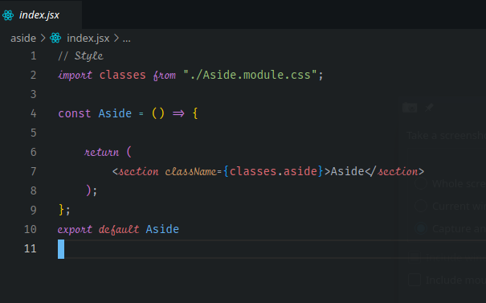

Have you heard of **DRY** before?  
In the world of programming, **DRY** stands for **D**on’t **R**epeat **Y**ourself. `React`, being a library, lacks a lot of the boilerplate code—you don’t even get a `components` folder in the `src` directory!!!

I’ve been working with `React` for almost 3 years now, and I can’t begin to tell you how much time I wasted on the structure of my project or creating [code snippets](https://code.visualstudio.com/docs/editor/userdefinedsnippets#_create-your-own-snippets) to help myself write code faster.

One thing `Angular` and `Vue` excel at is their **CLI** (Command Line Interface). You get a lot of things out of the box and won’t have to waste time on the mandatory setup to get a real project up and running.

Since `Angular` is a framework, it provides a specific folder structure, an out-of-the-box router, and a CLI tool that helps you easily create components.
You type one line `ng generate component component-name` and get a folder with the component name you specified, an `HTML` file, a `CSS` file, a `TypeScript` file, and a file for testing. With `Vue`, you get even **more** out of the box with their CLI tool: a router, global state management, unit testing, and end-to-end testing.

Today, I took it into my own hands to right this wrong.


Or at least try to.

I was so sick of manually creating a folder for my component, creating `JSX` and `CSS` files, and adding the template code for the 47,876,984,654th time. I had an idea of what I needed: **I needed to run a script!**

Here’s a preview of what our final script will look like:

```bash
#! /bin/bash
echo "what is the component name?"
read component
echo "jsx or tsx?" # find someway in the future to loop back if the value isn't jsx or tsx
read type # find someway in the future to loop back if the value isn't jsx or tsx
echo "I'll Create An Awesome ${component^} Component For You ✨✨"

mkdir $component
cd $component
touch index.$type
touch ${component^}.module.css

echo ".$component {" > ${component^}.module.css
echo " position: relative;" >> ${component^}.module.css
echo "}" >> ${component^}.module.css

if ["$type" = "jsx"];
then
    echo "// Style" > index.$type
    echo -e "import classes from \x22./${component^}.module.css\x22;" >> index.$type
    echo "" >> index.$type
    echo "const ${component^} = () => {" >> index.$type
    echo "" >> index.$type
    echo " return (" >> index.$type
    echo " <section className={classes.$component}>${component^}</section>" >> index.$type
    echo " );" >> index.$type
    echo "};" >> index.$type
    echo "export default ${component^}" >> index.$type
else
    echo "// Style" > index.$type
    echo -e "import classes from \x22./${component^}.module.css\x22;" >> index.$type
    echo "" >> index.$type
    echo "// Interface" >> index.$type
    echo "export interface ${component^}Props {" >> index.$type
    echo "" >> index.$type
    echo "}" >> index.$type
    echo "" >> index.$type
    echo "const ${component^} = (props:${component^}Props): JSX.Element => {" >> index.$type
    echo " const { } = props;" >> index.$type
    echo "" >> index.$type
    echo " return (" >> index.$type
    echo " <section className={classes.$component}>${component^}</section>" >> index.$type
    echo " );" >> index.$type
    echo "};" >> index.$type
    echo "export default ${component^}" >> index.$type
fi

echo "(￣^￣ )ゞ I'm done!"
```

But first, what is a script/bash script/shell script?

[](https://www.youtube.com/watch?v=I4EWvMFj37g)

NB: you can find what shells are installed on your system by opening your terminal and type

```bash
cat /etc/shells
```

This might sound awkward but, although I’ve been using different Linux distributions as my main operating system for the past 4 years, I never need to write a single script during that time 😅 There is no shame in using the GUI, but now I can understand why the community recommends investing time learning about scripting and CLI tools.

To my surprise, learning to write a script to do the task I had in mind wasn’t so hard, all I wanted was to automate the boilerplate creation of my components similar to the one in Angular. It took me a few hours of googling, asking the right questions, and watching a couple of tutorials on YouTube, but in the end, the job was finished successfully 😎

First things first, let’s open the terminal again, go to Desktop and create a playground folder, you can do so by following these commands

```bash
cd Desktop # This is a comment, all comments will have # before it, comments are ignored by the interpreter

mkdir bashExamples # mkdir stands for make directory
cd bashExamples # cd stands for change directory
```

Now we need to locate the bash interpreter

```bash
which bash
```

In my case the output was /bin/bash, we will need this location later so save the output on your clipboard.  
Now that we are in the bashExamples folder let’s create our first script.

```bash
nano component.sh # nano is a command line text editor, it will create a file called component.sh and open it in the terminal
```

Now let’s write our first script!

```bash
#! /bin/bash
echo "what is the component name?"
read component
echo "jsx or tsx?" # find someway in the future to loop back if the value isn't jsx or tsx
read type # find someway in the future to loop back if the value isn't jsx or tsx
echo "I'll Create An Awesome ${component^} Component for you ✨✨"
```

Then you click ctrl+x to exit, save? Y filename to write: I don’t want to change that so I click onenter

NB: emojis might look different in nano when you copy-paste them, this is ok, the output will be normal emojis when you run the script.

So what did we write?  
Remember the output from the which bash command that I told you we will need later, now is later, we need it on the first line of the file to let the interpreter know how to interpret our file and this is the syntax to do it with #!, think of this line as <!_DOCTYPE_ _html_> for the HTML file.

Then we use echocommand to output a text and save the value the user writes into a variable called component withread command, then we output another text with and save the value the user writes into a variable called type, then we output some text with the variable the user entered. The ${component^} syntax will capitalize the first letter in a variable.

You can run the script by writing bash component.sh   
This is the output I got after running the script at this point



I was prompted with a question asking me to enter the component name, I typed navbar and clicked enter, then I was prompted with the jsx or tsx? I typed tsx and clicked enter, and I got the output you see in the last line.

Ok, this is good, useless but, still good. Next, let’s make use of these variables and create a folder for our component, a CSS file, and another file (jsx or tsx) using those variables.

Open your file once again by typing nano component.sh , and add the code below

```bash
mkdir $component # make a directory/folder with the variable name stored in component
cd $component # change directory into that folder
touch index.$type # create a file called index with the file type entered
touch ${component^}.module.css # create a css file called with the component name entered
```

Then you click ctrl+x to exit, save? Y filename to write: I don’t want to change that, so I click onenter

Let’s run the script once more bash component.sh repeat what we did the first time and see the result of our newly added code, if you didn’t face an error you should have a navbar folder with index.tsx and Navbar.module.css files in it



Next, let’s write into a file, one thing I picked up from my senior at work is having my component wrapped in a section tag that has a className with the component name, and making this class a position relative in my CSS file so that anything absolutely positioned will be bounded by the boundaries of my component.

Open your file once again by typing nano component.sh and add the code below

```bash
echo ".$component {" > ${component^}.module.css
echo " position: relative;" >> ${component^}.module.css
echo "}" >> ${component^}.module.css
```

Then you click ctrl+x to exit, save? Y filename to write: I don’t want to change that, so I click onenter

So far we have been using echo only to show some text in the terminal but, echo can be used to add text to a file as well, to do that you will use > and >> at the end of your line followed by the file name.  
> will add text to the first line of the file, and >> will add text to the very next line.

So what does this code do?  
It will add a dot, the variable name stored in the component variable, and then will open curly braces to the first line of your CSS file, on the second line will add some spacing and position: relative; , and on the third line, it will add closing curly braces.

If we tested the code now and write navbar as our component name, we will get an error because a folder with that name already exists, we have two options, either delete that folder so we could create it again or create a component with another name, I will go with the latter.




Next, we will create the jsx/tsx file.   
Open your file once again by typing nano component.sh and add the code below

```bash
if ["$type" = "jsx"];
then
    echo "// Style" > index.$type
    echo -e "import classes from \x22./${component^}.module.css\x22;" >> index.$type
    echo "" >> index.$type
    echo "const ${component^} = () => {" >> index.$type
    echo "" >> index.$type
    echo " return (" >> index.$type
    echo " <section className={classes.$component}>${component^}</section>" >> index.$type
    echo " );" >> index.$type
    echo "};" >> index.$type
    echo "export default ${component^}" >> index.$type
else
    echo "// Style" > index.$type
    echo -e "import classes from \x22./${component^}.module.css\x22;" >> index.$type
    echo "" >> index.$type
    echo "// Interface" >> index.$type
    echo "export interface ${component^}Props {" >> index.$type
    echo "" >> index.$type
    echo "}" >> index.$type
    echo "" >> index.$type
    echo "const ${component^} = (props:${component^}Props): JSX.Element => {" >> index.$type
    echo " const { } = props;" >> index.$type
    echo "" >> index.$type
    echo " return (" >> index.$type
    echo " <section className={classes.$component}>${component^}</section>" >> index.$type
    echo " );" >> index.$type
    echo "};" >> index.$type
    echo "export default ${component^}" >> index.$type
fi

echo "(￣^￣ )ゞ I'm done!"
```

Then you click ctrl+x to exit, save? Y filename to write: I don’t want to change that, so I click onenter

Most of the syntax here isn’t new, we are just adding some text to a file, what you will find new are lines 4 and line 15 (basically the same line) and the syntax for writing an if statement. The thing about the if statement in shell is that spacing and indentation are important.

```bash
if ["$secretvariable" = "yes"] # the spacing here is important
then
     echo "yes" # indentation here is important
else
    echo "no" # indentation here is important
fi # this is how you end if statments
```

The idea in this small snippet is the same as that in my 32 lines code, If my secretvariable equals to “yes” it will output “yes” or else it will output “no”. I used the same idea in my 32-line code up there, but I am inserting text into a file instead.

The weird syntax in lines 4 and line 15 is used to add a double quotation to our text, notice that any echo statement starts and ends with a double quotation, I tried some suggestions from stack overflow but I couldn’t escape it 😔 luckily I found an answer where someone suggested another way around it using the ASCII codes of the double quotation character instead 😊 so that is all about the weird -e and \x22 .

let’s see the result of our hard work 🤞






NB: you might see an error Cannot find module ‘./yourModuleName.module.css’ or its corresponding type declarations. this is normal since we are not using a React project for testing but, a regular folder. I tested the script in a Typescript React project, and it didn’t show the error.

Now into the final scene, having you test the script in a React js/ts project 😅

We need to make component.sh available globally in our system, so we could call it from anywhere we like, this could be done easily on Linux, you will need to move the file to a folder called bin which you will find in the user folder, the path will be /home/[YourUserName]/bin

The steps to have a script available globally will probably be different depending on your operating system, so you will need to do some research on your own.

Edit: Hello this is Mazen from the future, I’m using Windows now 😭   
To make your script excutable you need to follow these steps:

1. Open a Git Bash shell as an administrator
2. Navigate to a directory that is already on the PATH.   
 cd /c/Windows/System32
3. Create a symbolic link to the component.sh script in the current directory using the ln command.  
ln -s "path/to/your/script/component.sh" component

Now you can call your script from anywhere by just typing component in your Bash.

And that’s it, I hope you can see now how useful it is to learn about bash scripting and how you can build on what I taught you to build the structure for your whole React project with a single command line.

The code I wrote is by no means the best code to do the job, my whole experience with scripting is just a few hours, I’m open to suggestions and ideas to refactor this code. Please write them down below in the comment section, and also if you built any script to automate some boring repetitive React-related task, feel free to share it down there.

Don’t forget to clap and share the post if you found it useful, it will help me write more often.

Ciao 👋

*This post was originally published on [Medium](https://medium.com/@mazenemam19/automate-the-boring-stuff-in-react-ee9b215f907b).*


