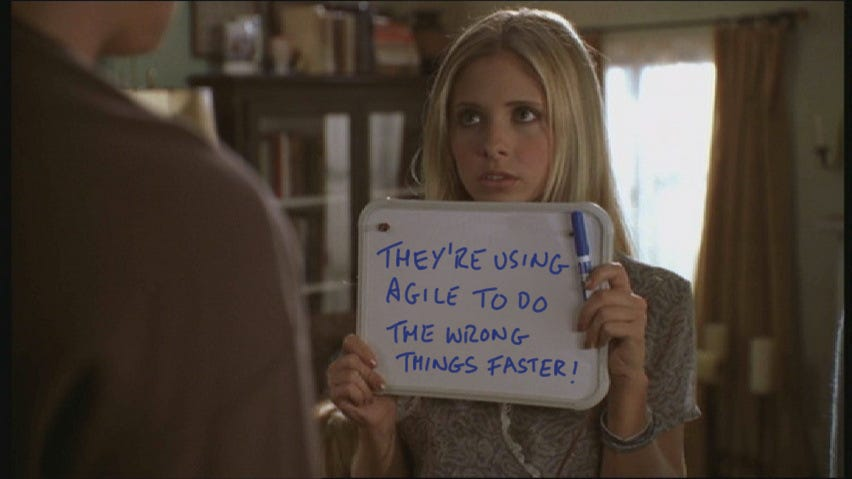

_Photo by Nubelson Fernandes on Unsplash_

[EgyptFWD](https://egfwd.com/) is a digital scholarship provided by the Egyptian Ministry of Communication and Information Technology.

Content:

1. Prerequisites
2. Duration
3. Who is this `React` Nanodegree for:
4. Applying process
5. A regular day/week
6. Program Syllabus

### 1. Prerequisites:

There are 2 types of prerequisites for this scholarship:  
General for any course, and specific to each course.

**A. The General prerequisites:**

- You’re Egyptian.
- You’re older than 18.

**B. The Specific prerequisites:**

- You have a good grasp of frontend fundamentals (`HTML`, `CSS`, `JS`)
- You have good knowledge of promises and asynchronous `Javascript`
- You have a basic understanding of the command line and `GIT` version control

I’d recommend that you have built some small-medium size projects from the ground up, like an e-commerce application for example before applying.  
“why?”  
Because by building this kind of project will ensure that you’re comfortable enough with `Javascript` arrays, objects, loops, DOM Manipulation, and all the other fundamentals that will set you on the right pass to success in the Nanodegree

> NB: one important thing that you should be aware of before applying is that the scholarship program has 3 tracks: Specialized Program, Cross-Skilling Program, and Expert Programs.

> The `React` Nanodegree belongs to the cross-skilling program, after finishing it, you may only apply to the courses from the expert program, but you can’t apply to courses from the specialized program or the cross-skilling program again.

> I’d advise you to check out all the courses on [EgyptFWD](https://egfwd.com/) first before applying as applying to courses from some tracks may prevent you from applying to others.

### 2. Duration:

The cohort duration is one month.

### 3. Who is this Nanodegree for?

In my opinion, this Nanodegree is a good addition to your knowledge arsenal if you’re just beginning with `React`. It will build you from the ground up, and the greatest part is that there are no jumping hoops or shortcuts. Everything is logical, you go from A to B to C to D, and there’s no A to D. But, my favorite thing about Udacity is the personalized project reviews 😍 this service is what makes Udacity better than all its competitors in my opinion, a human reviewing your code, not a machine just comparing the result.

If you’re an experienced `React` developer, I think you’ll enjoy the extracurricular section more than the core curricular (check out the content section)

### 4. Applying process:

The process is simple. after you go to [the `React` Nanodegree page](https://egfwd.com/specializtion/react-development/?s=react+nanodegree) and click apply, it will redirect you to a Udacity page where you get a couple of MCQ problems, you finish them, and submit your information, your national ID, etc … and that’s it. The absurd part is, that you don’t get to hear anything about your score (actually you won’t) and if you’re accepted or not till the very last day before the program starts, but after you receive that mail, it’s all up from here 🎉

### 5. A regular day/week

Your best friends during the scholarship are going to be `Slack` and `Google Calendar` 😂  
Slack is used as the main way of communication between you and the Udacity community moderator, session leads, and your peers.

Each week you will have one connect session (technical session), one career coaching session (career AMA session), one career webinar session (soft skills session), and one agile session (two throughout the whole scholarship).

The session duration is about two hours max, and they all start after 6 pm throughout the week. You’re also advised to study from 2 to 4 hours each day to ensure finishing all your graduation projects in time. Get ready to sharpen those time management skills of yours, no more slacking!

### 6. Program Syllabus

The curriculum consists of two parts: core and extra

**A. Core Curricular**

- `React` Fundamentals (1 Project)
- Foundations of Agile
- Career Services for EgFwd Program (4 Projects)

**B. Extracurricular**

- `React` & `Redux`

> NB: the content is a little different than what you see in the original [React Nanodegree](https://www.udacity.com/course/react-nanodegree--nd019) on Udacity

### Core Curricular

The most important module in the Core Curricular is the **`React` Fundamentals module** , here is where the magic happens, you start transitioning your mindset from the vanilla Javascript world into the DRY, `React`, and components world.

The React Fundamentals module consists of 5 lessons and 1 Project

- Why `React`
- Rendering UI with `React`
- State Management
- Hooks
- Routing

And the project would be relatively easy after you’re done with those 5 lessons

Next, **Foundations of Agile module** , I enjoyed learning about agile.

If you don’t know what agile is, it’s a different approach to managing projects.  
In agile, you publish a _working demo_ with the core features of your final project within 1 to 3 weeks (depending on the sprint length) then depending on the users’ feedback, the project development may go in another direction, you listen to that feedback, update and add new features and publish a new _working demo_ by the end of every sprint and this cycle continues till the project is done.

Meme time:

The last module is the **Career Service module** , this one is very straightforward, it focuses on your online presence and what you’d need when applying for a job.

It consists of 7 lessons and 4 projects, the lessons are:

- Resume Review
- Cover Letter Review
- Linkedin Review
- Conduct Industry Research
- Github Review
- Collaborate Using `Github`
- Write Meaningful READMEs

The 4 projects are:

- Resume Review
- Cover Letter Review
- Linkedin Review
- Github Review

### Extracurricular

In the extracurricular, you will go deep into `Redux` and the world of state management.

This part consists of only one module called `React` & `Redux` which consists of 6 lessons:

- Managing State
- UI + `Redux`
- `Redux` Middleware
- `Redux` with `React`
- Asynchronous `Redux`
- `React-Redux`

After you’re done with this module, you’ll need to have a look at [`Redux Toolkit`](https://redux-toolkit.js.org/) (`RTK`) and see how much faster/easier the work we used to do with plain `Redux` can be done with `RTK`.

And that’s it, hope the journey wasn’t long, boring, or intimidating 😅   
I promise it’s a fun ride, and you’ll gain a lot of valuable knowledge along the way. Did I miss something you’d like to know? feel free to shoot me your questions

Ciao 👋

*This post was originally published on [Medium](https://medium.com/@mazenemam19/egyptfwd-react-nanodegree-walkthrough-2094238d9c64).*
