In each Frontend Developer's life, there comes a time when they need to edit something in the bundler, luckily this day hasn't come yet for me, but I had some free time so I decided it was the time to demystify these keywords: `Webpack` -- `CRACO` -- `Bundles` -- `Chunks` -- `Bundle Size` -- `Code Splitting` -- `Dynamic imports`.

Through this post, I aim to explore the basics of `Webpack` with you and help you understand why it is important for modern web development.

So the first question is:

#### What is `Webpack`?

`Webpack` is a module bundler, that bundles the files in your project into one or multiple files (`bundles`). Then it does some extra cleanup (converting ES6 to older `JavaScript` -- minifying/uglifying -- tree shaking -- code splitting-- compressing and assets optimization and extra production mode-specific optimizations) to prepare your code for production. so in short, `Webpack` is the middleman between the development and the production code.

Another important job that `Webpack` does is to resolve dependencies and include them in the final bundle.  
Let me tell you a story about life before the front-end frameworks.

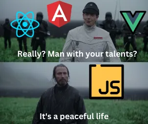

Back in the old, when we were using only `HTML`, `CSS`, and `JavaScript`, do you remember how we used to structure our `HTML` files?

```html
<!DOCTYPE html>
<html lang='en'>
<head>
    <meta charset='UTF-8'>
    <meta name='viewport' content='width=device-width, initial-scale=1.0'>
    <title>Document</title>
    <link rel='stylesheet' href='style.css'>
</head>
<body>
    
    <script src='script.js'></script>
</body>
</html>
```

What if we wanted to add `Bootstrap` to our project?

```html
<!DOCTYPE html>
<html lang='en'>
<head>
    <meta charset='UTF-8'>
    <meta name='viewport' content='width=device-width, initial-scale=1.0'>
    <title>Document</title>
    <link href="https://cdn.jsdelivr.net/npm/bootstrap@5.3.3/dist/css/bootstrap.min.css" rel="stylesheet" integrity="sha384-QWTKZyjpPEjISv5WaRU9OFeRpok6YctnYmDr5pNlyT2bRjXh0JMhjY6hW+ALEwIH" crossorigin="anonymous">
    <link rel='stylesheet' href='style.css'>
</head>
<body>
    
    <script src="https://cdn.jsdelivr.net/npm/bootstrap@5.3.3/dist/js/bootstrap.bundle.min.js" integrity="sha384-YvpcrYf0tY3lHB60NNkmXc5s9fDVZLESaAA55NDzOxhy9GkcIdslK1eN7N6jIeHz" crossorigin="anonymous"></script>
    <script src='script.js'></script>
</body>
</html>
```

Did you notice that your stylesheet and script are after `Bootstrap`'s stylesheet and script? why did we used to do that?

We would want the styles to override the default `bootstrap` styles or in the case of the script we wanted to make sure that the custom script runs the last thing on the webpage to make use of and override anything in the previous scripts, and to make sure that the rest of your page is fully rendered, so that when you do something like:

```javascript
document.querySelector('#firstName')
```

#firstName would exist on the DOM, the same goes for the `bootstrap` script, that's why the script is at the bottom of the page not at the top, it wants to ensure that the `HTML` is there before adding `JavaScript` to it.

So some dependencies are happening here, order matters and the element must exist in the DOM before we try to manipulate it.

In modern web development, you don't write `HTML` or scripts, you don't add `Bootstrap` link to the `HTML` head, you download a package, you will use a library like `react-bootstrap` and you would `import` the components into your files, right?

Here, you can see the first glimpse of `Webpack` magic happening behind the scenes, consider the following code:

```jsx
import Container from 'react-bootstrap/Container';
import Row from 'react-bootstrap/Row';
import Col from 'react-bootstrap/Col';

function AutoLayoutExample() {
  return (
    <Container>
      <Row>
        <Col>1 of 2</Col>
        <Col>2 of 2</Col>
      </Row>
      <Row>
        <Col>1 of 3</Col>
        <Col>2 of 3</Col>
        <Col>3 of 3</Col>
      </Row>
    </Container>
  );
}

export default AutoLayoutExample;
```

For the AutoLayoutExample component to render correctly, it depends on 3 other components (Container , Row , and Col) that don't exist in this file but must exist to have the AutoLayoutExample component rendering correctly. `Webpack` is our traffic man, it ensures that whatever code your components depend on exists before you use it, the same as putting the `HTML` before the scripts.

`Webpack` also helps us develop projects by running a development server. Back in the old days, to test your code changes, you would need to save the changed files and hit the refresh button, but this isn't the case now, you are no longer clicking the refresh button. When you run the start script `package.json` the script listed under start runs that creates a new instance of the `WebpackDevServer`, passing in the compiler and configuration. A listener method on the instance is called, passing in the port and host values. Then it clears the console and reads " Starting the development server…". The browser is opened with the correct dev URL. Lastly, two listeners are added for when the process is killed, which turns off the web server, and exits the start.js process.  
Under the hood, your start script looks something like this:

```json
"start": "webpack-dev-server --mode development --open"
```

This tells `Webpack` to spin up a development server, serve the files live, and open the browser to the port you specify in the `webpack.config` file (or it will use the [default 8080](https://webpack.js.org/configuration/dev-server/#devserverport)). If you are ready to build your project for final deployment, you will run the build script which might look like this under the hood:

```json
"build": "webpack --mode production"
```

This script will use the default `Webpack` config which looks up in your project root for a src directory and looks up for an index.js as the entry point, from index.js `Webpack` starts building a dependency graph, similar to the previous example where you would need Container , Row , and Col for the AutoLayoutExample to render correctly, so it goes and makes sure that `Bootstrap` exists ahead of rendering AutoLayoutExample since it depends on it.

Have you noticed that a typical `React` app doesn't have `Webpack` in `package.json` or a `webpack.config.js` file in the project tree?

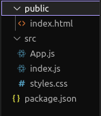
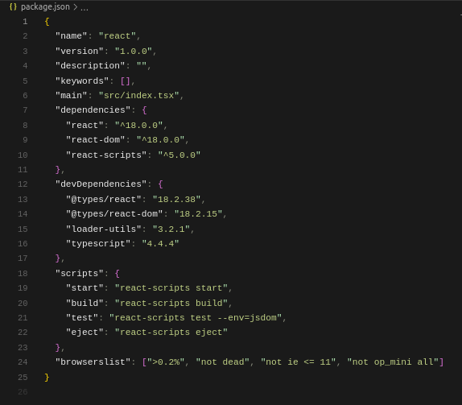

A Default Create-React-App

The reason for this is that the `React` team is already handling all of the `Webpack` configurations for you under the hood when you are using create-react-app , [they don't want developers to randomly tweak the `Webpack` configuration as they might introduce unexpected](https://github.com/facebook/create-react-app/issues/99#issuecomment-234657710) [behavior](https://github.com/facebook/create-react-app/issues/99#issuecomment-234657710) [that reduces the overall experience](https://github.com/facebook/create-react-app/issues/99#issuecomment-234657710).

But what if you know what you are doing? Well, there's a tool to help override `React`'s team `Webpack` config called `CRACO` (Create `React` App Configuration Override)

#### Here's how `CRACO` defines itself in its documentation:

> To customize most things when using [Create React App](https://create-react-app.dev/), you can eject. However, you'll then need to maintain every configuration and script yourself, which can be a bit annoying. `CRACO`, which stands for Create React App Configuration Override, allows you to get all of the benefits of [Create React App](https://create-react-app.dev/) without ejecting. Customize your configurations `ESLint`, `Babel`, `PostCSS`, and many more with just a single configuration file at the root of your project.

There's also a big warning underneath this definition:

> By doing this you're breaking the ["guarantees"](https://github.com/facebookincubator/create-react-app/issues/99#issuecomment-234657710) that CRA provides. That is to say, you now "own" the configs. No support will be provided. Proceed with caution.

So using `CRACO` is the equivalent of telling `React` "I'm a big boy, I know what I'm doing".

Well, in my case, I'm planning on using `CRACO` to analyze my build, I won't modify the default build script, I'll add a new script just for learning purposes to have a behind-the-scenes look at my bundles.

From here on out, I'll be analyzing a bloated private repo we use in my company, It is so big that I think It is the perfect candidate to learn about bundles and chunks.

But before installing any tool, why not use the ones in hand?  
We have the browser which can be a great starting point for learning how to analyze our bundles .. but what is a bundle? what is a chunk?

#### Bundle:

> Produced from a number of distinct modules, bundles contain the final versions of source files that have already undergone the loading and compilation process.

#### Chunk:

> This webpack-specific term is used internally to manage the bundling process. Bundles are composed out of chunks, of which there are several types (e.g. entry and child). Typically, chunks directly correspond with the output bundles however, there are some configurations that don't yield a one-to-one relationship.

When you're application is quite big it's meaningful to split up big bundles into chunks and load them lazily, generally speaking, it can decrease time loading dramatically.

Analyzing bundles is a good first step to optimize the amount of Javascript shipped to the browser which can improve page load time and directly result in better `Large Contentful Paint` (`LCP`) and `First Input Delay` (`FID`)  
by decreasing the time the browser needs to parse, analyze, and compile the code.

Consider the following case where I went into the users' page in my app:

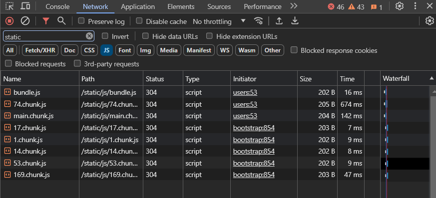

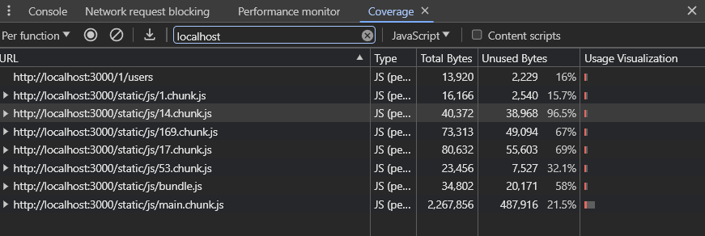

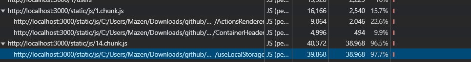

In the screenshots above you can see the chunks sent by the server to load this page in the network tab, additionally, you can also see the size of the chunk and the time needed to send these chunks from the server to the browser, in the coverage tab you can see the size of the unused bytes from the chunks, additionally, in development mode only, you can see a source map indicating to the actual files in your chunk, you can find it by clicking on the dropdown indicator next to your chunk.

Notice that 14.chunk.js has one file which is `useLocalStorage` custom hook that has 97.7% of unused bytes that's an indicator that maybe we should recheck our usage for `useLocalStorage`, maybe we don't need it on this page.

Using the Network and Coverage tab can be a good start if we already have a small and focused scope to analyze but if we are interested in a bird eye analysis of our project we would need help from some 3rd party tools.

The first thing we will do is install `CRACO` and a `Webpack` plugin called `webpack-bundle-analyzer` these packages will help us view the bundled code outputted by `Webpack` when we run our new script:

```bash 
yarn add @craco/craco webpack-bundle-analyzer progress-bar-webpack-plugin chalk --dev
```

then we can add a new script to our `package.json` under scripts called analysis

```json
"scripts": {
        "analysis": "craco build",
        // other scripts
 
}
```

and we create a `craco.config.js` and add the following code

```javascript
const chalk = require('chalk');
const ProgressBarPlugin = require('progress-bar-webpack-plugin');
const BundleAnalyzerPlugin =
    require('webpack-bundle-analyzer').BundleAnalyzerPlugin;


module.exports = {
    webpack: {
        plugins: [
            new BundleAnalyzerPlugin({
                analyzerMode: 'server',
            }),
            new ProgressBarPlugin({
                format: `${chalk.green('analyzing...')} ${chalk.green(
                    '[:bar]'
                )}${chalk.green('[:percent]')}${chalk.green(
                    '[:elapsed seconds]'
                )} - :msg`,
            }),
        ],
    },
};
```

NB: `CommonJS` syntax is used because `webpack` config files are executed in a `Node.js` environment.

In this file, we are using `BundleAnalyzerPlugin` to open up a server after the build to visually display the size and contents of the `Webpack` output files, and using `ProgressBarPlugin` to show a progress bar in the terminal during the build, indicating how much of the build has been completed and how long it has been running. Lastly, we are using `chalk` to add some coloring to the terminal

This is the result of running our analysis script:

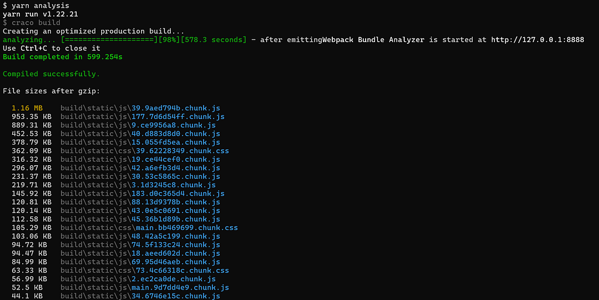

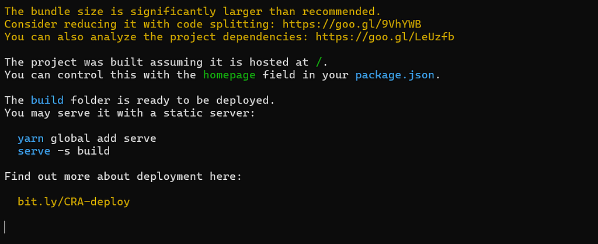

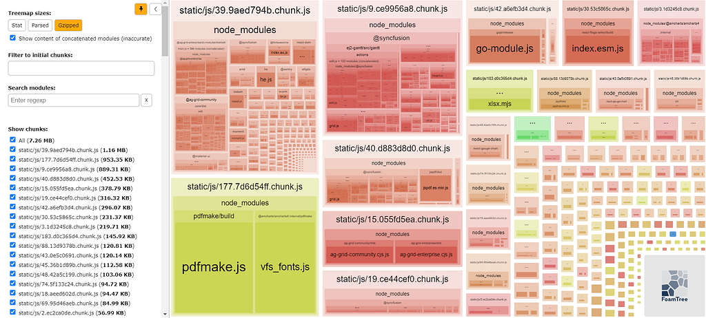

**What is this?**

This is our final bundle, including both the application code and any dependencies it relies on, including those from node\_modules after code splitting and various webpack optimizations. BundleAnalyzerPlugin provides us with 3 views:

*   **Stat**: This view shows the raw size of each module in your bundle before any optimizations are applied. It gives you an idea of the size of each file/module in your project.
*   **Parsed**: In this view, you see each module's size after `Webpack` has parsed and processed them. This typically includes tree shaking, `code` splitting, and other optimizations. So, the numbers you see in this view reflect the size of the modules after `Webpack` has applied various optimizations.
*   **Gzipped**: This view shows the size of each module after gzip compression is applied. Gzip compression is a standard technique to reduce the size of files sent over the network further. The numbers in this view represent the estimated size of each module after compression.

Generally when talking about the **bundle size** we mean the **Gzipped size**, but both Parsed and Gzipped are important metrics, Parsed size helps us understand how much work the browser has to do when it loads the app, while gzipped size tells us how fast the app will download and start running for users.

We can enhance the output by adding magic comments to our Lazy imports in `React`.

**Lazy imports or Lazy loading :**

> is an optimization technique that delays the loading of certain parts of your application `code` until they are needed. This improves the initial load time and overall performance of your `React` app.

```jsx
import React from 'react';

const Users = React.lazy(() =>
    import(
        /* webpackChunkName:"Users" */ 'path/to/users/page'
    )
);


return (
<React.Suspense fallback={<div>loading....</div>}>
  <Users/>
<React.Suspense>
)
```

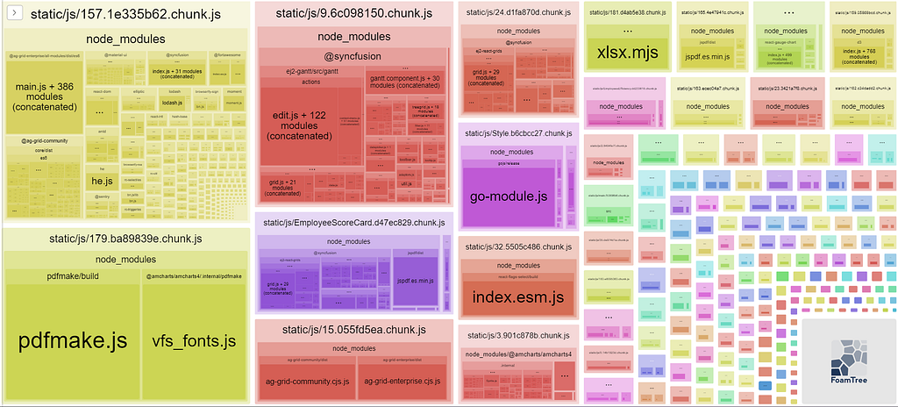

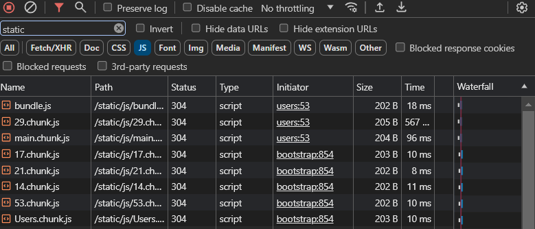

The Output After Using `Webpack` Magic Comment

This enhanced result can make a good starting point for enhancing our enormous bundle, After I narrowed down the selection to our top eight chunks (They make about 2/3 of our bundle size😲) and after adding Webpack magic comment to the lazy imported routes components, I can identify two of the biggest problematic chunks, `EmployeeScoreCard` (452 KB) chunk and `Style chunk` (296 KB)

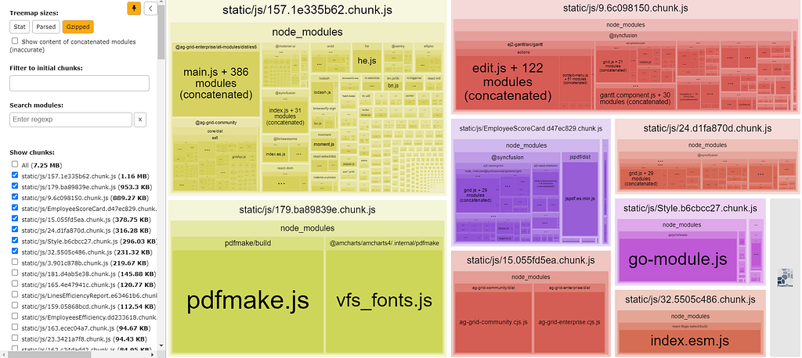

The Bad Wolves

2 ways commonly used to optimize the bundle size are Lazy Loading and Dynamic Imports, I can go further and Lazy Load some of the components inside EmployeeScoreCard resulting in breaking this chunk into multiple chunks, this is the result:


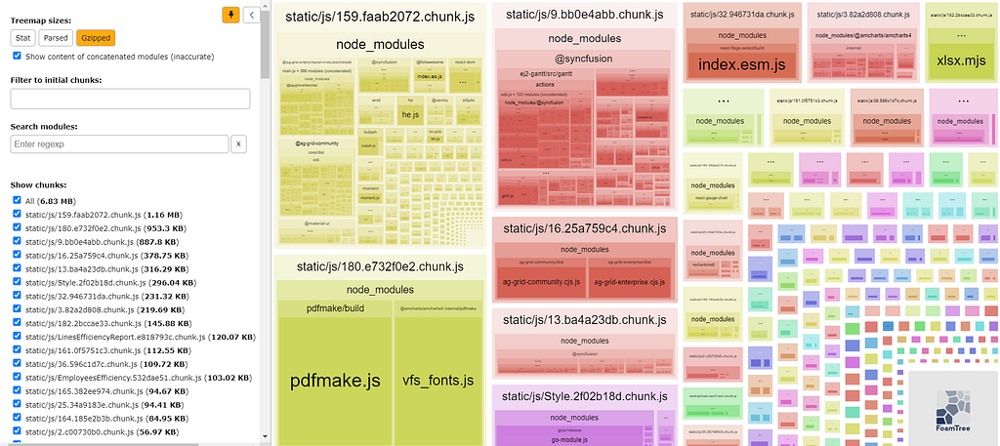

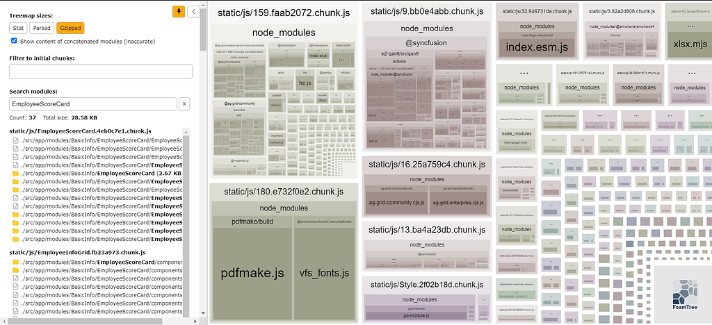

EmployeeScoreCard became much smaller after Lazy Loading the component inside, it is not showing up at all unless we implicitly went on and looked it up, you can also see in the last picture a chunk called `EmployeeInfoGrid` , the result of this simple enhancement is so surprising even for me, our total chunk size decreased from 7.25MB to 6.83MB, a 6% decrease 🤯

The second way we can go about optimizing our bundle is by using Dynamic Imports inside our chunks, **Dynamic Imports** are usually used with conditional loading based on user action, consider the following code:

```jsx
import React, { useState } from 'react';

const Dashboard = () => {
  const [showUserDetails, setShowUserDetails] = useState(false);
  const [UserDetails, setUserDetails] = useState(null);

  const handleClick = async () => {
    if (!UserDetails) {
      const { default: UserDetailsComponent } = await import('./UserDetails');
      setUserDetails(UserDetailsComponent);
    }
    setShowUserDetails(true);
  };

  return (
    <div>
      <button onClick={handleClick}>View Details</button>
      {showUserDetails && UserDetails && <UserDetails user={/* your user data */} />}
    </div>
  );
};

export default Dashboard;
```

Here, we are only importing the `UserDetailsComponent` after the user clicks the button, this way we create a separate `chunk` for `UserDetailsComponent`

**Following these techniques could vastly decrease your bundle size which will result in:**

*   Reducing initial load
*   Reduce bandwidth usage
*   Improve browser caching
*   Lower bounce rate
*   Improve user experience
*   Better `SEO`

**But I think my №1 tip to have a smaller bundle size is:**

> "Avoid installing 3rd party libraries whenever possible."

I know what you will say:

*   "You want me to reinvent the wheel?"
*   "That library is making my life easier."

I'm not prohibiting you from installing them 😅 Just be resourceful, if you would look closely into the terminal output or `webpack analyzer output`, all those unnamed chunks are node\_modules , zero logic code, and an extra debt we gotta carry.

I love libraries like the very next person, but if you are installing libraries in your project you must

*   Maintain/Upgrade them regularly
*   Don't install multiple libraries doing the same job,
*   Stay up to date, libraries get deprecated, browsers have features being added to them to replace libraries each day.

One last thing you can do after analyzing your bundle, if having these libraries is a must, try replacing them with smaller ones. A tool like [https://bundlephobia.com/](https://bundlephobia.com/) can be a great aid in your journey before installing your next package.

Wishing you a smaller bundle and a bug-free day.

*This post was originally published on [Medium](https://mazenemam19.medium.com/exploring-webpack-778d9a469b29).*
