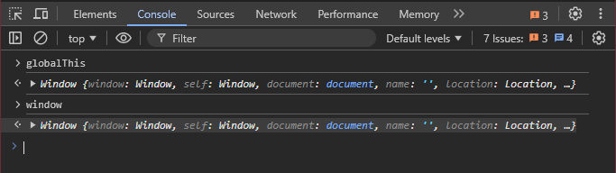

I'm excited to share that we are successfully transitioning from create-react-app (CRA) to Vite in my workplace! 🎉

Switching wasn't straightforward, but it was necessary. Our app was becoming increasingly sluggish, and the developer experience (DX) was deteriorating. I found myself leaving my laptop on all day because restarting the app was painfully slow. If you ever removed node\_modules, reinstalled them, and attempted to start the app, you could lose an hour just waiting for everything to download and start up again. The app would usually take 12-15 minutes to start--a significant delay, especially when dealing with urgent bug reports. Additionally, [CRA is deprecated and is no longer recommended for bootstrapping React applications](https://medium.com/r?url=https%3A%2F%2Freact.dev%2Flearn%2Fstart-a-new-react-project).

**Why Vite?**

Initially, I considered using [Rspack](https://rspack.dev/), which is touted as

> A drop-in replacement for webpack, with more powerful features and exceptional productivity.

However, the transition wasn't as seamless as I had hoped. Although Rspack is nearing production readiness (at version [1.0.0-beta.4](https://github.com/web-infra-dev/rspack/releases/tag/v1.0.0-beta.4) as of this writing), I decided to opt for the more mature and battle-tested solution: [Vite](https://vitejs.dev/).

Moving away from Webpack and CRA gave me a newfound appreciation for these tools and the effort behind them. They simplify so much of the development process and provide a ready-to-use setup.

I hope that one day we'll have a true drop-in replacement for CRA and Webpack, so we won't need to make extensive file changes when switching to tools like Vite.

If you have no idea what Webpack, Vite, or Rspack are, I went down this rabbit hole in [my last post](https://mazenadel19.medium.com/exploring-webpack-778d9a469b29), I explored Webpack and what it does. Vite and Rspack are more modern tools doing a similar job but more efficient.

### My Experience with Vite: Pros and Cons

Before diving into how I transitioned our old app to Vite, I'd like to share the pros and cons I've encountered during my brief experience using Vite in development and production environment.

#### Pros:

*   **Faster Startup:** After a fresh install, our server startup time was drastically reduced. With Webpack, it used to take up to 30 minutes; with Vite, it now takes about 8.5 minutes. Subsequent startups went from 12-15 minutes to just 1.5 minutes. While this might still seem slow, it's a win considering the complexity of our project.

> Note:_ The laptop I'm testing on is quite old. On a newer machine with better specs, startup times were as low as 20-30 seconds for the second start.

*   **Faster Build Time:** Our GitHub workflow build time decreased from 12-13 minutes to just 7 minutes -- almost half the time! This transition saves our development team at least 20 minutes per developer each day.


With Webpack


With Vite

#### Cons:

*   **Different Bundlers for Development and Production:** Vite uses esbuild for development and Rollup for production, which has been a significant pain point. Some pages worked perfectly in development but crashed in production. This discrepancy required manual testing and troubleshooting, though there weren't many issues overall.

### Planning the Transition: How to Migrate from CRA to Vite

#### Do Your Research:

This is the most crucial step. Extensive research is essential. I browsed Reddit to read about other developers' experiences transitioning from CRA to Vite. Most agreed that the process is tricky but worth the effort. Additionally, I read several blog posts on the steps needed to move a CRA app to Vite, as there is no official tutorial or documentation on this topic now.

#### Build Your Action Plan:

*   **Convert** **.js files to** **.jsx:**  
    This was a surprising challenge, as [Vite doesn't support](https://github.com/vitejs/vite/issues/769#issuecomment-780593283) [.js](https://github.com/vitejs/vite/issues/769#issuecomment-780593283) files as Webpack does. Manually converting all .js files to .jsx was out of the question, but luckily, I found a [CLI tool](https://github.com/jaw52/transform-jsx-for-vite) that automated the process.
*   **Remove** **react-script, install** **vite, create** **vite.config.js:**  
    Ensure you're using a Vite version compatible with your Node.js version. After that, remove react-scripts, install vite, and create the vite.config.js file.

```bash yarn remove react-scripts yarn add vite @vitejs/plugin-react --dev
```

and in the project root

```javascript
import react from '@vitejs/plugin-react';
import { defineConfig } from 'vite';

export default defineConfig({
    plugins: [react()],
    build: { // to output your build into build dir the same as Webpack
        outDir: 'build',
    },
    server: {
        open: true,
        port: 3000,
    },
});
```

*   **Move** **index.html to the project root and fonts to the public directory then update reference paths to the fonts accordingly.**
*   **Remove** **%PUBLIC\_URL% from links in** **index.html.**

```html
<link rel="icon" href="%PUBLIC_URL%/favicon.ico" /> ❌ 
<link rel="icon" href="/favicon.ico" /> ✅
```

*   **Add Script pointing at your project entry point in** **index.html**

```html
<body>
  <noscript>You need to enable JavaScript to run this app.</noscript>
  <div id="root"></div>

  <script type="module" src="/src/index.jsx"></script>
</body>
```

*   **Replace environment variables:**  
    Replace REACT\_APP with VITE in .env , update process.env.NODE\_ENV with `import`.meta.env.MODE and process.env.REACT\_APP with `import`.meta.env.VITE in your code.
*   **Configure** **eslint:**  
    Install vite-plugin-eslint and update vite.config.js to include the plugin.

```bash yarn add vite-plugin-eslint --dev
```
```javascript
`import` react from '@vitejs/plugin-react';
`import` { defineConfig } from 'vite';
`import` eslintPlugin from 'vite-plugin-eslint';

`export` default defineConfig({
    plugins: [react(), eslintPlugin()],
    build: {
        outDir: 'build',
    },
    server: {
        open: true,
        port: 3000,
    },
});
```

*   **Revalidate your GitHub workflows:**  
    Update any workflow steps that reference react-scripts to use vite.

#### Fix Environment-Specific Issues:

1.  **Change all** **require images to module imports.**

*   **Issue:** In CRA, images were commonly loaded using require statements, which won't work with Vite.
*   **Solution:** Replace require with ES module imports. For instance:

```javascript
 ❌
```
```javascript
`import` Logo from 'assets/images/logo.svg'; 


 ✅
```

**2\. Resolve** **globalThis is not defined.**

*   **Issue:** Vite doesn't automatically provide globalThis, which can cause issues if your code relies on it, Webpack was polyfilling it for us.



global variable "globalThis" in a Webpack application

*   **Solution:** Add a manual definition for globalThis in your index.jsx file

```
window.global ||= window;
// just double checked my code and I'm a bit skeptical of why I'm not using
// `window.globalThis`and why my code is working with `window.global` 🤔
```

**3\. Generate source maps for error monitoring.**

*   **Issue:** By default, Vite may not generate source maps, which are essential for debugging when you use an error monitoring tool.
*   **Solution:** Enable source maps in your vite.config.js:

```javascript
`import` react from '@vitejs/plugin-react';
`import` { defineConfig } from 'vite';
`import` eslintPlugin from 'vite-plugin-eslint';

`export` default defineConfig({
    plugins: [react(), eslintPlugin()],
    build: {
        outDir: 'build',
        sourcemap: true,
    },
    server: {
        open: true,
        port: 3000,
    },
});
```

**4\. Fix global SASS variables.**

*   **Issue:** Vite may not handle global SASS variables defined with :`export` as CRA does.
*   **Solution:** Move global SASS variables to a JavaScript file. For example:

```javascript
//theme.scss ❌

:`export` { 
    primaryColor: $app-primary;
    secondaryColor: $secondary;
     ....
}
```
```html
`import` theme from '../styles/theme.scss';


<div style={{ color: theme.primaryColor }}>Hello World</div>
```

Will be replaced by

```javascript
// theme.js ✅

`const` theme = { 
    primaryColor: '#10142a',
    secondaryColor: '#2695a2',
    .....
}

`export` default theme;
```
```html
`import` theme from '../styles/theme.js';

<div style={{ color: theme.primaryColor }}>Hello World</div>
```

**5\. Handle absolute imports for** **.jsx files.**

*   **Issue:** Absolute imports might not work properly in Vite.
*   **Solution:** Configure aliases in vite.config.js:

```javascript
`import` react from '@vitejs/plugin-react';
`import` { defineConfig } from 'vite';
`import` eslintPlugin from 'vite-plugin-eslint';

`export` default defineConfig({
    plugins: [react(), eslintPlugin()],
    build: {
        outDir: 'build',
        sourcemap: true,
    },
    resolve: {
        alias: [
            { find: 'actions', replacement: '/src/actions' },
            { find: 'assets', replacement: '/src/assets' },
            { find: 'components', replacement: '/src/components' },
            .....
            { find: 'styles', replacement: '/src/styles' }, 
        ],
    },
    server: {
        open: true,
        port: 3000,
    },
});
```

**6\. Handle absolute imports for** **.scss files.**

*   **Issue:** Vite might not resolve absolute imports for SCSS files correctly in the production environment, for example, The code below was importing a file called app.\[hash\].js (not a part of my build) instead of app.\[hash\].css in production

```javascript
`import` MyComponent from 'components/MyComponent';
`import` styles from 'styles/app.scss';

<MyComponent className={styles.someClassName} />
```

*   **Solution:** I tried falling back to the relative path of the file but it didn't work 🤷‍♂️, I opted into `import` SCSS files globally since these classes were shared through the application

```javascript
// index.jsx
`import` React from 'react';
`import` { render } from 'react-dom';
`import` Main from './pages/Main';

// Import SCSS globally
`import` './global.scss';

render(<Main/>, document.querySelector('#root'));
```
```
// global.scss

.class1{...}
.class2{...}

...

// cut & paste classes from styles/app.scss here 
// then drop that cursed file
```

then I'd use them like vanilla CSS

```bash
<MyComponent className='someClassName' />
```

**7\. Address third-party library issues.**

*   **Issue:** Some libraries may not be fully compatible with Vite.
*   **Solution:** Update or replace incompatible libraries. In my case, I needed to:  
     -- Replace jsonwebtoken with jsonwebtoken-esm  
     -- Replace react-notifications with react-toastify  
     -- Use lodash-es instead of lodash  
     -- Update libraries like react-bootstrap-sweetalert and recharts to their latest versions

### Conclusion

Transitioning from create-react-app to Vite has been a challenging but rewarding experience. The performance improvements alone have made the effort worthwhile, and I believe this will significantly boost both developer productivity and overall project maintainability. By carefully addressing these issues, you can make the most of Vite's modern tooling and improve the efficiency of your development workflow.

*This post was originally published on [Medium](https://mazenemam19.medium.com/migrating-from-create-react-app-to-vite-boosting-performance-in-legacy-applications-63bbd93861e5).*
